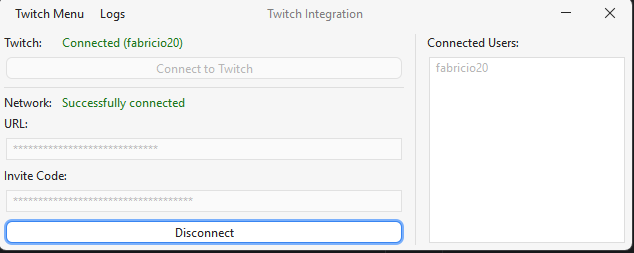

# TTV Shared Integration

This tool allows streamers and mod developers to synchronize integrations between shared chat sessions. It's a simple
backend that broadcasts polls and channel reward redeems between all connected channels, allowing members of all
communities to interact with the target mod or event.



How it works:

- Streamer A runs `client` and connects to Twitch
- Streamer B runs `client` and connects to Twitch
- Streamers A and B connect to the same `server` using the same `invite`
- Streamers A and B can now do API requests to create rewards, polls, etc..
- Polls and Rewards are created on both Streamer A and Streamer B's channels
- Poll result and updates are combined at the `server` and sent to both streamer A and B
- Reward claims are sent to both streamer A and B

In short it works as one would imagine shared rewards and shared polls during a shared chat session. Do note however
that a shared chat session is NOT necessary for this tool to work.

**No twitch tokens are ever sent over the wire**, all communication done with Twitch is done by the `client` application
which runs locally on each streamer's computer. The `server` component simply acts as a shared room where all streamers
can broadcast commands to each other.

Please note that only Twitch Affiliates and Twitch Partners can use polls and channel point rewards, this is a
limitation on twitch's side.

## For users

To use this application, you must have at least Java 21 installed, then simply download the latest `ttv-client.jar` from
the releases page. You can easily download Java 21
from [here](https://www.azul.com/downloads/?version=java-21-lts&os=windows&package=jdk#zulu). Make sure to grab the
`.msi` version for a one-click installer. During the installation, if prompted, allow the installer to set the
`JAVA_HOME` variable and update the `PATH` variable.

If you play minecraft it's very likely you already have a supported java version, you can check this by opening `cmd`
and typing `java -version` which should return with something similar to the message below (note the 21 version number).

```
$ java -version
openjdk version "21.0.3" 2024-04-16 LTS
OpenJDK Runtime Environment Zulu21.34+19-CA (build 21.0.3+9-LTS)
OpenJDK 64-Bit Server VM Zulu21.34+19-CA (build 21.0.3+9-LTS, mixed mode, sharing)
```

As this is entirely made in Java, it should work flawlessly under Linux and MacOS as well, however it's only been tested
in Windows.

### As the "host"

- Execute the application
- Click on `Connect to Twitch`
- Authorize the OAuth pop-up on twitch (make sure `manage rewards` and `manage polls` are allowed)
- The application should display that twitch is connected and your account's username
- Now copy the `Invite` field (or type in a custom invite)
- Click on `Connect to Network`
- Once it's connected, everything should be setup
- You should see your username on the list of users to the right

### As the "guest"

- Execute the application
- Click on `Connect to Twitch`
- Authorize the OAuth pop-up on twitch (make sure `manage rewards` and `manage polls` are allowed)
- The application should display that twitch is connected and your account's username
- Fill the `invite` field with the invite code sent by the host
- Click on `Connect to Network`
- Once it's connected, everything should be setup
- You should see your username on the list of users to the right and the usernames of all other connected users

Once you are done using this application, you may click the `Twitch` menu and click on `Disconnect`, this will cause the
application to cleanup any changes it did to your channel and disconnect completely.

In case of errors, logs are available in the `logs` folder near the executable, you can also enable debug logs by
clicking on the `Logs > Enable Debug Logs` menu.

## For developers (API)

When running the `client` locally, it exposes a JSON-RPC api under `http://localhost:5583`, mod authors can then
send specific commands to the client, which will propagate it to the server, causing all clients to interact with
twitch's API.

### Events

The `client` application exposes all server events under `/websocket` for websocket and `/sse` for http
server-sent-events, you can use these endpoints to receive real-time notifications for when rewards get claimed or polls
finish.

You may use whichever option you find most appropriate to implement on your mod. Don't forget reconnect logic.

### Polls

To create a poll, send a POST request to `/polls` with the following JSON body.

```json
{
  "id": "unique_id_for_your_own_tracking",
  "title": "Is this working?",
  "points": null,
  "duration": 60,
  "choices": [
    {
      "id": "true",
      "title": "Yes"
    },
    {
      "id": "false",
      "title": "No"
    }
  ]
}
```

This of course follows twitch's own poll rules, `title` must be a valid string, `duration` (seconds) must be specified
and at least 15 seconds, `choices` is an array with at most 5 entries and at least 2 entries, all entries must contain
both a tracking `id` and the option's `title` (valid string). `points` can be set to an integer to enable channel point
voting, null to keep it disabled.

Once the poll is created, the server will send poll created, poll updates and a single poll finished event for when
it deems a poll has finished. These events will use the IDs specified on the above request.

Poll IDs must be unique for this `invite`, it's recommended that every time you want to create a poll you simply
generate a random GUID/UUID as the poll `id`. Choice IDs do not need to be unique across polls.

### Rewards

Twitch rewards are synchronized to all connected channels, and are stored on the server-side for re-synchronization when
clients reconnect due to network partitions/failures.

To create a twitch reward, send a POST request to `/rewards` with the following JSON body.

```json
{
  "id": "testing",
  "title": "test reward",
  "cost": 1,
  "color": "#FF00AA",
  "limitPerStream": null,
  "limitPerUser": null,
  "cooldown": null,
  "prompt": null
}
```

This also follows twitch's API rules for rewards, the only REQUIRED fields are `id`, `title` and `cost`. ID being an
internal tracking ID that must be unique for this reward. It is recommended to use a descriptive ID and reuse said ID
when attempting to update rewards.

Optional fields:

- `color` specifies the background color in twitch's UI (hex code)
- `limitPerStream` integer total limit of uses in a stream for this reward
- `limitPerUser` integer total limit of uses PER USER in a single stream for this reward
- `cooldown` integer in SECONDS that enables a cooldown on this reward
- `prompt` textual prompt (instructions) in case input is required from the user

Since rewards are stored in the `server`, it's possible to PUT a whole set of rewards at once by sending a PUT to
`/rewards` with a json array containing all desired rewards.

```json
[
  {
    "id": "testing",
    "title": "test reward",
    "cost": 1
  },
  {
    "id": "testing2",
    "title": "another reward",
    "cost": 2
  }
]
```

It's also possible to DELETE a twitch reward, to do so send a DELETE request to `/rewards/{id}` where the `id` parameter
is the previously-specified custom reward id.
